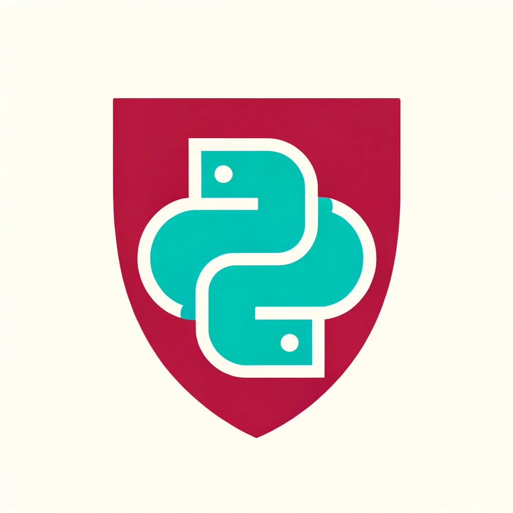

# SDPython's Data Cleaning & Preprocessing Toolkit 🛠️

<p align="center">
  
</p>

---

<div align="center">


[](https://github.com/ja-godfrey/SDPython-toolkit/stargazers/)

</div>

---

## 📑 Table of Contents

- [Overview](#overview)
- [Features](#features)
- [Installation](#installation)
  - [Creating a Virtual Environment](#creating-a-virtual-environment)
  - [Installing Dependencies](#installing-dependencies)
- [Modules](#modules)
- [Examples](#examples)
- [Contributing](#contributing)
- [License](#license)
- [Contact](#contact)

---

## 🌟 Overview

This Data Cleaning & Preprocessing Toolkit is a comprehensive Python library that makes the data wrangling phase of your Data Science projects as smooth as butter. With a focus on code reusability and ease of use, this toolkit is the perfect addition to your Data Science arsenal.

> "In God we trust. All others must bring data." - W. Edwards Deming (Ostensibly).

---

## 🎁 Features

- **Missing Value Handling**: Say goodbye to missing data woes.
- **Outlier Management**: Handle outliers like a pro.
- **Feature Engineering**: Transform raw data into insights.
- **Text Cleaning**: Get your text data in shape.
- **Data Integrity Checks**: Ensure your data is clean and reliable.
- **Class Imbalance Handling**: Balance your datasets like a yogi.

---

## 🛠️ Installation

### Creating a Virtual Environment

1. Open your terminal and run:

   ```bash
   python3 -m venv SDPython

This will create a new Python virtual environment named `SDPython`.

2. Activate the virtual environment:

   - **macOS and Linux:**

     ```bash
     source SDPython/bin/activate
     ```

   - **Windows:**

     ```bash
     .\SDPython\Scripts\Activate
     ```

### Installing Dependencies

After activating the virtual environment, navigate to the directory where `requirements.txt` is located and run:

```bash
pip install -r requirements.txt
```

This will install all the required packages.
---

## 📦 Modules

- **[missing_values.py](./missing_values.py)**: Impute and manage missing values.
- **[outliers.py](./outliers.py)**: Detect and handle outliers effectively.
- **[feature_engineering.py](./feature_engineering.py)**: Tools for feature creation and transformation.
- **[text_cleaning.py](./text_cleaning.py)**: Essential text cleaning operations.
- **[integrity_checks.py](./integrity_checks.py)**: Functions for checking data integrity.
- **[imbalance_handling.py](./imbalance_handling.py)**: Address class imbalance problems.

> Check out the [`examples/`](./examples/) folder for usage examples!

---

## 📖 Examples

Visit the [`examples/`](./examples/) folder for Jupyter Notebooks demonstrating how to use each module.

> 🔍 Each example walks you through the process, explaining every step.

---

## 👥 Contributing

We love contributions! Please see [`CONTRIBUTING.md`](./CONTRIBUTING.md) for details on how you can contribute.

---

## 📜 License

This project is licensed under the MIT License - see the [`LICENSE.md`](./LICENSE.md) file for details.

---

## 📞 Contact

- **Website** - [jasongodfrey.info](jasongodfrey.info)
- **Email** - jason.godfrey@accelerate.com

> If you like this project, please give it a ⭐ [on GitHub](https://github.com/ja-godfrey/SDPython-toolkit/)! 😊

